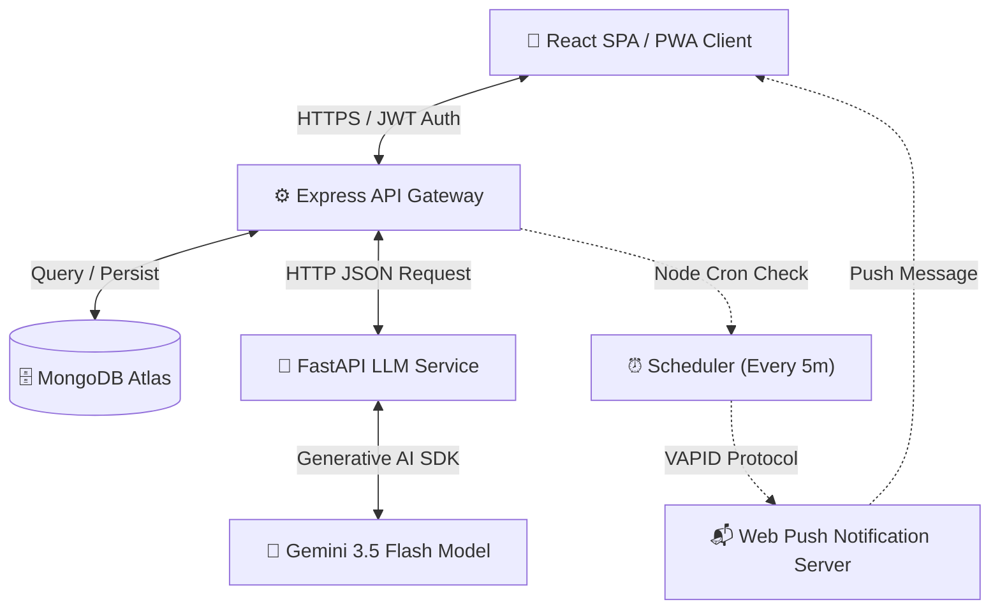

# 🚀 TaskFlow — AI-Powered Task Manager

TaskFlow is an intelligent, modern, mobile-first personal task manager that leverages the MERN stack coupled with a Python FastAPI microservice powered by **Gemini 3.5 Flash** to bring automation and contextual intelligence to task management.

With TaskFlow, users can manage their academic, professional, and personal tasks seamlessly. They can create tasks manually or just describe them in natural language, upload screenshots of syllabus lists or work emails, chat with an AI assistant that knows their task calendar, and receive web push reminders right when deadlines are close.

---

## 🗺️ System Architecture

TaskFlow is structured as a microservices-based application divided into three primary components:
1. **Client (Frontend)**: React (Vite-powered SPA/PWA) built with custom vanilla CSS variables, interactive toast alerts, custom modal views, and a dedicated service worker for asset caching and push notifications.
2. **Server (Backend API)**: Node.js and Express RESTful API managing JWT authentication, MongoDB state persistence via Mongoose schemas, and background cron scheduling of Web Push notifications.
3. **LLM Service (AI Microservice)**: Python FastAPI app integrating Gemini 3.5 Flash to handle multimodal task extraction (text or images) and context-aware conversational chat.



---

## ✨ Key Features

### 🌟 Smart Task Lists
* **Categorized Boards**: Dedicated, interactive boards for **College**, **Job**, and **Study** with smooth, responsive CRUD.
* **Due Today Dashboard**: An executive summary layout gathering all items scheduled for the current calendar date with progress indicators.
* **Modern CSS Styling**: Custom CSS layout that features dark-mode styling, glassmorphism UI structures, sleek state transitions, and responsive views optimized for mobile.

### 🧠 Multimodal AI Classification
* **Instant Auto-Categorization**: Enter task descriptions like *"Finish the math homework before tomorrow at 4 PM"*. The LLM service extracts the title, generates a summary description, parses the correct due date (relative to the user's current date), and automatically files it under the **College** category.
* **Visual Task Extraction**: Upload a photo or screenshot of a homework sheet, email thread, or meeting schedule. The Gemini model extracts the tasks, formats them, and adds them directly into your database.

### 💬 Context-Aware AI Chat Page
* **Task-Cognizant AI Assistant**: A chat interface that automatically feeds the user's current task list to the AI context.
* **Conversational Commands**: Ask the chatbot details like *"What should I focus on today?"* or *"Do I have any pending assignments for my job?"* and receive dynamic, Markdown-formatted summaries of your workspace.
* **Dynamic Action Triggers**: Say *"Add a task to submit the resume review this Thursday"*. The chat agent recognizes the intent, sets the action mode to `create_task`, dynamically generates the task details, alerts you, and creates the database record automatically.

### 📬 Web Push Notifications
* **VAPID Web Push Protocols**: Implements native web push protocols for background reminders.
* **Time-Triggered Dispatch**: A backend cron-driven task checks the database every 5 minutes and flags tasks due soon (within 30 minutes) or overdue, dispatching visual browser alerts even when the browser is closed.
* **Resilient Subscription Lifespan**: Cleans up stale push endpoints automatically if subscription access status returns `410 Gone`.

### 📱 Installable PWA (Progressive Web App)
* **PWA Caching Policy**: Integrates a robust `sw.js` Service Worker implementing network-first strategy for dynamic API routes and cache-first lookup for offline-accessible assets.
* **Installable Manifest**: Fully installable manifest (`manifest.json`) enabling users to pin TaskFlow directly to their phone homescreen or desktop dock with native splash screens.

---

## 🛠️ Tech Stack

| Layer | Technologies & Libraries | Description |
| :--- | :--- | :--- |
| **Frontend** | React 18, Vite, Vanilla CSS, Web Push API | Client PWA interface with CSS variables. |
| **Backend** | Node.js, Express, Mongoose, Node-Cron, Web-Push | API Gateway, scheduling, authentication. |
| **LLM Microservice** | Python 3.10+, FastAPI, Google Generative AI | High-speed AI parsing and JSON structural validation. |
| **Database** | MongoDB Atlas, MongoDB Node Driver | Document store with compound query indexes. |
| **Security** | JWT (JSON Web Tokens), bcrypt.js | Secure stateless authentication and salted hashing. |

---

## 🗄️ Database Schemas

TaskFlow operates on three primary collections stored inside MongoDB, modeled securely using Mongoose schemas:

### 1. User Schema (`User.js`)
Stores user profiles and background subscription identifiers for dispatching Web Push Notifications.
* **`username`**: String, unique, required, trim-enabled, limits 3-30 characters.
* **`passwordHash`**: String, required, stores bcrypt-salted hashes.
* **`pushSubscription`**: Object, stores endpoint keys and secret credentials for browser notifications.

### 2. Task Schema (`Task.js`)
Defines structure, scheduling, and notifications tracking logic for task items.
* **`userId`**: Mongoose ObjectId referencing `User` (Indexed).
* **`title`**: String, required, max length 200.
* **`description`**: String, default empty, max length 1000.
* **`category`**: String, enum `['College', 'Job', 'Study']` (Indexed).
* **`dueDate`**: Date, default null (Indexed).
* **`status`**: String, enum `['pending', 'done']`, default `'pending'` (Indexed).
* **`source`**: String, tracking how a task was made: `['manual', 'chat-text', 'chat-image']`.
* **`notifiedDueSoon`**: Boolean, tracks if 30-minute alert was sent.
* **`notifiedOverdue`**: Boolean, tracks if past-due alert was sent.

### 3. Chat Session Schema (`ChatSession.js`)
Tracks context and multi-turn conversations with the AI Assistant.
* **`userId`**: Mongoose ObjectId referencing `User` (Indexed).
* **`title`**: String, defaults to `'New Chat'`.
* **`messages`**: Subdocument array of `chatMessageSchema` consisting of:
  * `role`: String, enum `['user', 'assistant']`.
  * `content`: String, containing user query or AI response text.
  * `image`: String, base64 data URI representing optional user attachments.
  * `taskResult`: Sub-object capturing parsed task components (`title`, `description`, `category`, `dueDate`) if the AI triggered a task creation event.

---

## ⚙️ Local Development Setup

### Prerequisites
* **Node.js** v18 or higher
* **Python** v3.10 or higher
* **MongoDB Atlas Cluster** (or local MongoDB database instance)
* **Google Gemini API Key** (for access to `gemini-3.5-flash`)

### 1. Environment Configurations

Create `.env` files in their respective folders prior to starting the services.

#### 📂 Server Configuration (`server/.env`)
```ini
PORT=5000
MONGODB_URI=your_mongodb_atlas_connection_string
JWT_SECRET=your_super_secret_jwt_encryption_key
LLM_SERVICE_URL=http://localhost:8000
VAPID_PUBLIC_KEY=your_generated_vapid_public_key
VAPID_PRIVATE_KEY=your_generated_vapid_private_key
VAPID_EMAIL=mailto:you@example.com
```
*To generate your VAPID keys easily, run the utility script:*
```bash
cd server && node utils/generateVapidKeys.js
```

#### 📂 LLM Service Configuration (`llm-service/.env`)
```ini
GEMINI_API_KEY=your_google_gemini_api_key
```

---

### 2. Dependency Installation

Perform installation in the root folder to boot up all sub-projects concurrently:

```bash
# Installs concurrently in root
npm install

# Installs server & client packages automatically
npm run install-all

# Configure LLM Python Virtual Environment
cd llm-service
python -m venv venv
venv\Scripts\activate  # On Windows PowerShell/Command Prompt
# or: source venv/bin/activate on Mac/Linux

pip install -r requirements.txt
```

---

### 3. Launching the Project

You can run each service independently or boot them all together in a single terminal from the root workspace using the configured `concurrently` script:

```bash
# Run client, server, and FastAPI service in parallel
npm run dev
```

The terminal will log out consolidated outputs from all three services:
* **React SPA Client** will mount at `http://localhost:3000`
* **Express API Gateway** will mount at `http://localhost:5000`
* **FastAPI LLM Microservice** will mount at `http://localhost:8000`

---

## 🚢 Production Deployment

The project is pre-configured with a Render Infrastructure Blueprint blueprint (`render.yaml`). To deploy:

1. Push your project files to your GitHub account repository.
2. Log in to the [Render Console](https://render.com) and click **New** ➡️ **Blueprint**.
3. Link your GitHub repository. Render will parse your `render.yaml` orchestration configuration.
4. Input the required environment variables:
   * `MONGODB_URI`, `JWT_SECRET`, `VAPID_PUBLIC_KEY`, `VAPID_PRIVATE_KEY`, and `VAPID_EMAIL` for the Express service.
   * `GEMINI_API_KEY` for the Python service.
5. Trigger **Deploy**! Render will deploy the backend API, the Python service, and set up a static CDN redirect for your React PWA.
